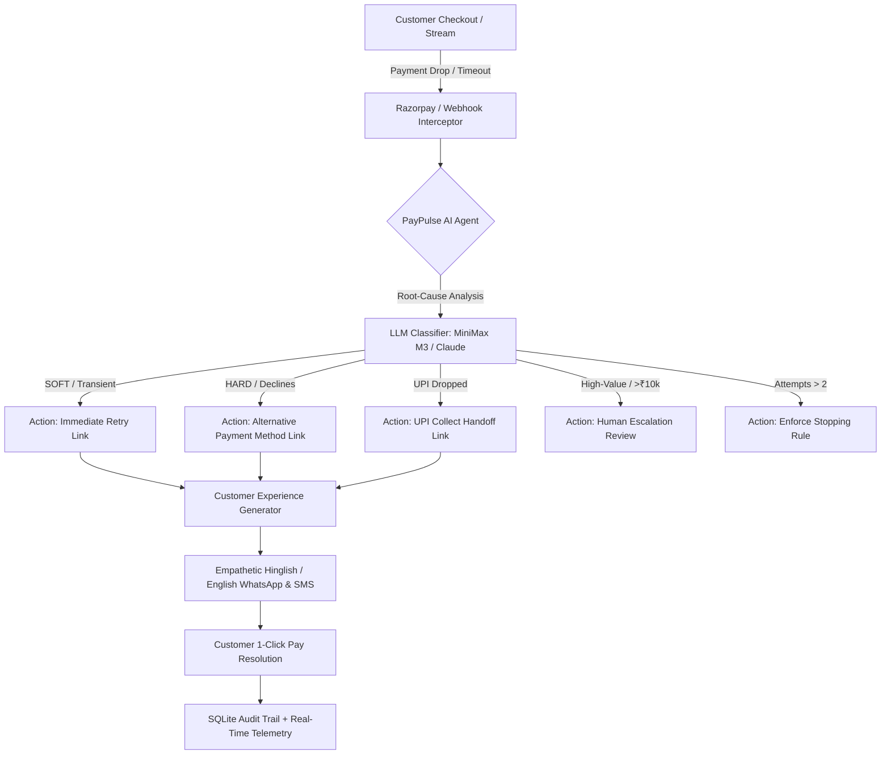

# PayPulse ⚡
### Autonomous AI Payment Failure Recovery Agent · Razorpay AI Buildathon 2026

> **Detect. Decide. Recover.**  
> PayPulse intercepts checkout dropouts across Razorpay payment streams in $< 2$ seconds, diagnoses the root cause using OpenRouter (`minimax/minimax-m3:free`) or Claude, autonomously creates personalized WhatsApp / SMS recovery links, and reclaims lost GMV with zero customer fatigue.

---

## 🚀 Key Capabilities & Architecture



### 1. 🛍️ Luxury E-Commerce Storefront Demo (Closed Loop)
- **Flagship Audio & Tech Catalog:** Test authentic purchases (*Titanium Apex Smartwatch Pro*, *SonicPro Spatial ANC Headphones*, *UrbanCraft Nomad Backpack*).
- **1-Click Failure Sandbox:** Trigger real-world failure conditions (*Bank Gateway Timeout*, *UPI PSP Dropout*, *Card Issuer Decline*).
- **Sub-2s Autonomous Interception:** The agent intercepts the dropout within 1.5s, diagnoses the failure, and delivers a WhatsApp recovery message directly to the customer's phone simulator.
- **1-Click Customer Payment Resolution:** Simulate the customer completing the recovery link and watch the live telemetry, revenue projections, and Audit Trail update instantaneously!

### 2. 📱 Smartphone Recovery Experience & Phone Simulator
- **iPhone 16 Pro Frame:** Realistic titanium bezel with Dynamic Island notch pill, live status bar (time, WiFi, battery), and authentic WhatsApp chat bubble styling with double blue ticks (`✓✓`).
- **Empathetic AI Copy Generator:** Produces conversational Hinglish / English messages with personalized customer names and rupee amounts, strictly adhering to character guardrails ($\le 300$ chars for WhatsApp, $\le 160$ chars for SMS).
- **1-Click Resolution Action:** Direct **`⚡ Simulate Customer Paying Link`** button with confirmation feedback.

### 3. 🎛️ Merchant Policy & Guardrails Studio (v3.0)
- **One-Click Policy Templates:**
  - ⚖️ **Balanced E-Commerce** *(Max 2 retries, ₹10k escalation, 15s poll)*
  - ⚡ **High-Velocity Blitz** *(Max 3 retries, ₹25k escalation, 10s poll)*
  - 🛡️ **VIP Conservative** *(Max 1 retry, ₹5k escalation, 30s poll)*
- **Live Dynamic Stream Polling Rescheduling:** Changing the stream polling interval immediately reschedules APScheduler in the backend and updates the UI in real time.
- **Strict Stopping Rule Safeguards:** Halts recovery after configured attempts to prevent customer harassment.

### 4. ⚡ Autonomous Batch Recovery Pipeline
- **Volume & Failure Controllers:** One-click order pills (`[10]`, `[25]`, `[50]`, `[100]`) and dynamic failure rate slider.
- **Live 4-Step Stepper Pipeline:** *1. Orders Seeded $\rightarrow$ 2. Failures Flagged $\rightarrow$ 3. AI Diagnosis (M3) $\rightarrow$ 4. Links Dispatched*.
- **Comprehensive Post-Run Report:** Real-time breakdown of recovery conversion and total GMV saved.

### 5. 💰 Projected Revenue Recovery & Annual ROI Model
- **Logarithmic GMV Slider:** Models revenue recovery from ₹10 Lakhs to ₹100 Crores/month based on RBI's 7.5% baseline failure rate and live agent recovery telemetry.

---

## 🛠️ Tech Stack

| Layer | Technologies |
| :--- | :--- |
| **Backend** | Python 3.12, FastAPI, SQLite with `aiosqlite`, APScheduler, Razorpay Python SDK, OpenRouter / Anthropic SDK, Pydantic v2, uvicorn |
| **AI Models** | OpenRouter `minimax/minimax-m3:free`, Anthropic Claude 3.5 Sonnet, Deterministic Rule Fallback |
| **Frontend** | React 18, Vite, TypeScript, Tailwind CSS, Recharts, Framer Motion, TanStack React Query, Lucide Icons |
| **Testing** | Pytest, AnyIO, Asyncio (17/17 automated integration & unit tests) |

---

## ⚡ Getting Started

### 1. Prerequisites
- Python 3.11+
- Node.js 18+
- Active Razorpay Test Keys (`RAZORPAY_KEY_ID`, `RAZORPAY_KEY_SECRET`)
- OpenRouter API Key (for MiniMax M3) or Anthropic Key

### 2. Installation & Setup

```bash
# Clone the repository
git clone https://github.com/Jeswanth-009/PayPulse.git
cd PayPulse

# Backend Setup
pip install -r backend/requirements.txt

# Frontend Setup
cd frontend
npm install
cd ..

# Configure Environment Variables (.env)
# RAZORPAY_KEY_ID=rzp_test_...
# RAZORPAY_KEY_SECRET=...
# OPENROUTER_API_KEY=sk-or-v1-...
# OPENROUTER_MODEL=minimax/minimax-m3:free
```

### 3. Running Locally

```bash
# Terminal 1: Backend Server (FastAPI)
python -m uvicorn backend.main:app --host 0.0.0.0 --port 8000 --workers 1

# Terminal 2: Frontend Dev Server (Vite)
cd frontend && npm run dev
```

Visit **`http://localhost:5173`** in your browser.

---

## 🧪 Automated Test Suite

Run the full integration test suite:

```bash
pytest -v
```

**Results:** `17 passed, 0 failed (100% Pass Rate)`.

---

## 📖 Complete API Reference

| Method | Endpoint | Description |
| :--- | :--- | :--- |
| `POST` | `/api/v1/batch/run` | Seeds orders via Razorpay test mode and runs autonomous recovery pipeline |
| `GET` | `/api/v1/batch/{batch_id}/report` | Aggregated recovery rate, money at risk, and failure breakdown |
| `POST` | `/api/v1/studio/fire` | Synchronously fires preset/custom failure through the agent pipeline |
| `GET` | `/api/v1/studio/presets` | List of quick failure presets |
| `GET` | `/api/v1/payments/{payment_id}/message` | Customer-facing WhatsApp & SMS recovery copy and rationale |
| `POST` | `/api/v1/payments/{payment_id}/simulate-pay` | Simulates customer completing the recovery link and captures payment |
| `GET` | `/api/v1/config` | Fetches runtime merchant policy configuration |
| `PUT` | `/api/v1/config/{key}` | Updates merchant policy setting with live APScheduler rescheduling |
| `GET` | `/api/v1/agent/status` | Real-time agent status, active queue, and live polling interval |
| `GET` | `/api/v1/audit` | Paginated immutable audit trail of all agent decisions and outcomes |
| `POST` | `/webhook/razorpay` | Ingests live Razorpay webhooks with HMAC-SHA256 signature verification |

---

## 🏆 Razorpay AI Buildathon 2026 Submission

- **Repository:** [https://github.com/Jeswanth-009/PayPulse](https://github.com/Jeswanth-009/PayPulse)
- **Demo Walkthrough & Video Script:** See [`DEMO_GUIDE.md`](file:///c:/PayPulse/DEMO_GUIDE.md)
- **Engineering Post-Mortem & Fixes:** See [`WHAT_BROKE.md`](file:///c:/PayPulse/WHAT_BROKE.md)
