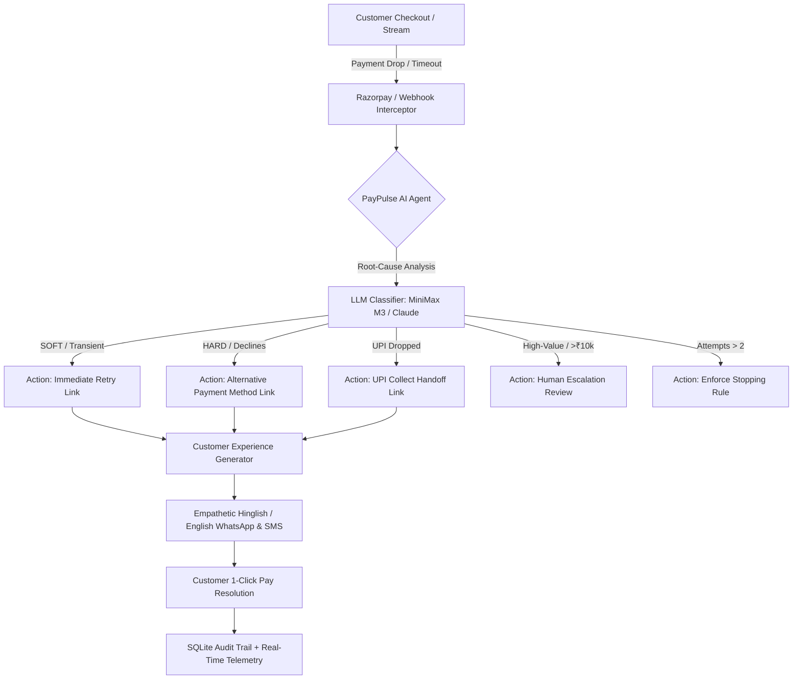

# PayPulse ⚡
### Autonomous AI Payment Failure Recovery Agent · Razorpay AI Buildathon 2026

> **Detect. Decide. Recover.**  
> PayPulse intercepts checkout failures across Razorpay payment streams in $< 2$ seconds, diagnoses the root cause using OpenRouter (`minimax/minimax-m3:free`) or Claude, autonomously creates personalized WhatsApp / SMS recovery links, and saves lost GMV with measurable ROI.

---

## 🚀 Key Capabilities & Architecture



### 1. 🛍️ End-to-End Storefront Checkout Demo (Closed Loop)
- **Live Simulated E-Commerce Store:** Experience a real purchase from the buyer's perspective.
- **1-Click Failure Simulator:** Trigger real-world failure scenarios (*Bank Gateway Timeout*, *UPI PSP Dropout*, *Card Issuer Decline*).
- **Autonomous Interception:** The agent intercepts the dropout within 1.5s, diagnoses the failure, and delivers a WhatsApp recovery message directly to the customer's phone simulator.
- **1-Click Pay Resolution:** Simulate the customer completing the recovery link and watch the dashboard metrics and money saved count update live!

### 2. 📱 Customer Recovery Experience & Phone Simulator
- **High-Definition Smartphone Preview:** Dynamic iOS/Android frame with notch and status bar.
- **WhatsApp & iOS SMS Cross-Fade:** Switch seamlessly between WhatsApp business messages with formatted payment links and native iOS Messages.
- **Empathetic AI Copy Generator:** Produces conversational Hinglish / English messages with personalized customer names and rupee amounts, strictly adhering to guardrails ($\le 300$ chars for WhatsApp, $\le 160$ chars for SMS).

### 3. 🧪 Failure Studio Sandbox
- **Instant Error Injector:** Test presets (*Bank Timeout*, *UPI Dropped*, *Card Declined*, *High-Value Basket*) or build custom payloads.
- **Synchronous Diagnostic Execution:** Creates real Razorpay test orders, classifies via LLM, mints live payment links (`https://rzp.io/...`), and returns full diagnostic audit records.

### 4. 🎛️ Merchant Policy Studio
- **Configurable Guardrails:** Adjust `max_retry_attempts` (1–3), `escalation_threshold` (₹1,000–₹100,000), `llm_provider` (OpenRouter / Claude / Rule Fallback), and `agent_poll_interval` with instant runtime persistence.

### 5. 💰 Merchant ROI Calculator
- **Logarithmic GMV Slider:** Models revenue recovery from ₹10 Lakhs to ₹100 Crores/month based on RBI's 7.5% baseline failure rate and live agent recovery telemetry.

### 6. 🔔 Real-Time Recovery Notifications & Toast Feed
- Live floating toasts in the top-right corner alert merchants when a payment is recovered with 1-click inspection.

---

## 🛠️ Tech Stack

| Layer | Technologies |
| :--- | :--- |
| **Backend** | Python 3.12, FastAPI, SQLite with `aiosqlite`, APScheduler, Razorpay Python SDK, OpenRouter / Anthropic SDK, Pydantic v2, uvicorn |
| **AI Models** | OpenRouter `minimax/minimax-m3:free`, Anthropic Claude 3.5 Sonnet, Deterministic Rule Fallback |
| **Frontend** | React 18, Vite, TypeScript, Tailwind CSS, Recharts, Framer Motion, TanStack React Query, Lucide Icons |
| **Testing** | Pytest, AnyIO, Asyncio (17/17 automated integration & unit tests) |

---

## ⚡ Getting Started

### 1. Prerequisites
- Python 3.11+
- Node.js 18+
- Active Razorpay Test Keys (`RAZORPAY_KEY_ID`, `RAZORPAY_KEY_SECRET`)
- OpenRouter API Key (for MiniMax M3) or Anthropic Key

### 2. Installation & Setup

```bash
# Clone the repository
git clone https://github.com/Jeswanth-009/PayPulse.git
cd PayPulse

# Backend Setup
pip install -r backend/requirements.txt

# Frontend Setup
cd frontend
npm install
cd ..

# Configure Environment Variables (.env)
# RAZORPAY_KEY_ID=rzp_test_...
# RAZORPAY_KEY_SECRET=...
# OPENROUTER_API_KEY=sk-or-v1-...
# OPENROUTER_MODEL=minimax/minimax-m3:free
```

### 3. Running Locally

```bash
# Terminal 1: Backend Server (FastAPI)
python -m uvicorn backend.main:app --host 0.0.0.0 --port 8000 --workers 1

# Terminal 2: Frontend Dev Server (Vite)
cd frontend && npm run dev
```

Visit **`http://localhost:5173`** in your browser.

---

## 🧪 Automated Test Suite

Run the full integration test suite:

```bash
pytest -v
```

**Results:** `17 passed, 0 failed (100% Pass Rate)`.

---

## 📖 Complete API Reference

| Method | Endpoint | Description |
| :--- | :--- | :--- |
| `POST` | `/api/v1/batch/run` | Seeds orders via Razorpay test mode and runs autonomous recovery |
| `GET` | `/api/v1/batch/{batch_id}/report` | Aggregated recovery rate, money at risk, and failure breakdown |
| `POST` | `/api/v1/studio/fire` | Synchronously fires preset/custom failure through the agent pipeline |
| `GET` | `/api/v1/studio/presets` | List of quick failure presets |
| `GET` | `/api/v1/payments/{payment_id}/message` | Customer-facing WhatsApp & SMS recovery copy and rationale |
| `POST` | `/api/v1/payments/{payment_id}/simulate-pay` | Simulates customer completing the recovery link and captures payment |
| `GET` | `/api/v1/config` | Fetches runtime merchant policy configuration |
| `PUT` | `/api/v1/config/{key}` | Updates merchant policy setting with range validation |
| `GET` | `/api/v1/audit` | Paginated audit trail of all agent decisions and outcomes |
| `POST` | `/webhook/razorpay` | Ingests live Razorpay webhooks with HMAC-SHA256 signature verification |

---

## 🏆 Razorpay AI Buildathon 2026 Submission
Built with ❤️ for Indian E-Commerce merchants losing crores to payment dropouts every month.
